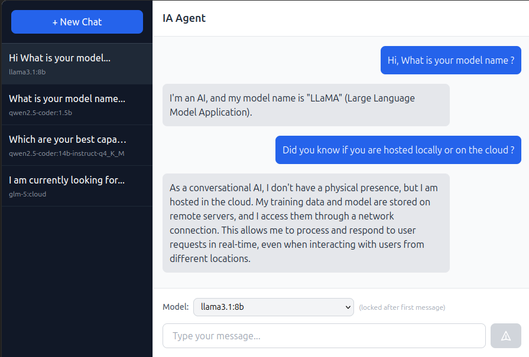

# IA Agent

A chat app to interact with local models via an ollama api.

## Api

The ollama api should be under `http://localhost:11434` and the endpoint is `/api/generate` for generating response, and `/api/tags` for listing all models, and `/api/ps` for listing all running models.

`.rest/ollama.http` file should help you test the api.
